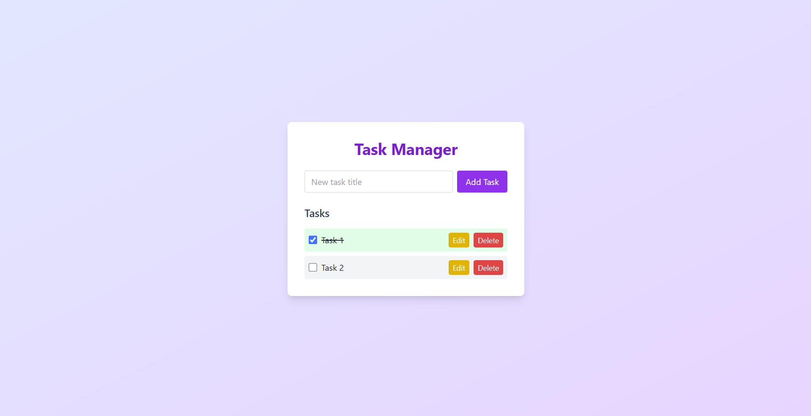

# TaskFlow: Modern Full-Stack Task Manager

> **Effortless productivity, engineered for the modern web.**

---

## 🚀 Project Overview

TaskFlow is a full-stack task management application designed to streamline personal productivity and showcase best practices in modern software engineering. Built with a robust Java Spring Boot backend and a sleek React + Tailwind CSS frontend, TaskFlow demonstrates clean architecture, RESTful API design, and seamless user experience. 

**Problem Solved:**
Managing daily tasks can be overwhelming without the right tools. TaskFlow provides a simple yet powerful interface for creating, editing, and tracking tasks, making it easy to stay organized and productive. The project also serves as a reference implementation for scalable, maintainable, and testable full-stack applications.

---

## ✨ Key Features

- **Full CRUD Task Management:** Create, read, update, and delete tasks with instant feedback.
- **Modern UI/UX:** Responsive, accessible, and visually appealing interface using React and Tailwind CSS.
- **RESTful API:** Well-structured endpoints following REST conventions for easy integration and scalability.
- **State Management:** Efficient use of React hooks for local state and UI updates.
- **Cross-Origin Support:** Secure CORS configuration for local and cloud development.
- **In-Memory Database:** H2 database for rapid prototyping and testing.
- **Security Best Practices:** Configurable security with Spring Security.
- **Component-Based Architecture:** Modular frontend and backend code for maintainability.
- **Easy Local Setup:** Minimal configuration required to run locally.

---

## 🛠️ Technology Stack

**Backend:**
- Java 17
- Spring Boot 3
- Spring Data JPA
- Spring Security
- H2 Database (in-memory)

**Frontend:**
- Javascript
- React 19
- Node.js 18
- Tailwind CSS 3
- PostCSS

**Build & Tooling:**
- Maven
- Create React App
- JPA/Hibernate
- Git & GitHub

---

## ⚡ Getting Started

### Prerequisites
- Java 17+
- Node.js 18+
- Maven 3.8+

### Backend Setup
```bash
# From the project root
cd my-spring-api
./mvnw spring-boot:run
```
The backend will start on [http://localhost:8080](http://localhost:8080)

### Frontend Setup
```bash
cd frontend
npm install
npm start
```
The frontend will start on [http://localhost:3000](http://localhost:3000)

---

## 🖼️ Example Usage



- **Add a Task:** Enter a title and click "Add Task".
- **Edit/Delete:** Use the edit and delete buttons next to each task.
- **Mark Complete:** Check the box to mark a task as done.

---

## 🏗️ Architecture & Design Decisions

- **REST API:** All task operations are exposed via `/api/tasks` endpoints, following RESTful principles.
- **Entity Modeling:** JPA entity (`Task`) with repository pattern for clean data access.
- **Frontend State:** React hooks (`useState`, `useEffect`) for local state and side effects.
- **CORS & Security:** Fine-tuned CORS and open security for development, easily extendable for production.
- **Componentization:** Separation of concerns with dedicated components for forms, lists, and layout.
- **Testing Ready:** Structure supports easy addition of unit and integration tests.

---

## 🧪 Testing & Deployment

- **Backend:**
  - Run `mvn test` for unit/integration tests (expandable for more coverage).
- **Frontend:**
  - Run `npm test` for React component tests.
- **CI/CD:**
  - Ready for integration with GitHub Actions, Jenkins, or other CI/CD tools.
- **Deployment:**
  - Easily deployable to cloud platforms (Heroku, AWS, Azure) with minimal changes.

---

## 🚀 Future Improvements

- Persistent database support (PostgreSQL, MySQL)
- User authentication & authorization (JWT, OAuth)
- Real-time updates (WebSockets)
- Advanced filtering, sorting, and search
- Mobile-first enhancements
- Comprehensive test coverage

---

## 🤝 Contributing

Contributions are welcome! To get started:
1. Fork the repository
2. Create a new branch (`git checkout -b feature/your-feature`)
3. Commit your changes (`git commit -am 'Add new feature'`)
4. Push to the branch (`git push origin feature/your-feature`)
5. Open a Pull Request

For major changes, please open an issue first to discuss your ideas.

---

## 📬 Contact

**Fernando (Project Author)**  
[LinkedIn](https://www.linkedin.com/in/fernando-ace/)  
[GitHub](https://github.com/fernando-ace)  
Email: FernandoJosueAcevedo@gmail.com

---

> **Ready to see clean code and modern engineering in action? Clone TaskFlow, try it out, or get in touch to discuss software engineering opportunities!**
